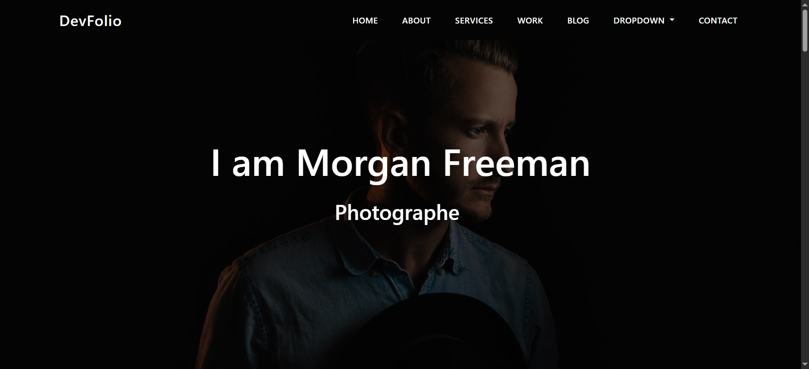

# DevFolio - Personal Portfolio Website

DevFolio is a responsive and modern personal portfolio website template built with HTML, CSS, Bootstrap, and Font Awesome. It's perfect for showcasing a developer's skills, projects, testimonials, and blog content.

## 🔍 Preview
   

## 🚀 Features

- Fully responsive layout
- Sticky navigation bar
- Hero header with animated text
- About section with skill bars
- Services overview cards
- Animated counters
- Portfolio grid
- Testimonials carousel
- Blog section
- Font Awesome & Bootstrap icons

## 🛠️ Built With

- HTML5
- CSS3
- Bootstrap 5
- Font Awesome
- JavaScript (for interactivity and Bootstrap components)

## 📁 Folder Structure

📦 DevFolio ├── index.html ├── style.css ├── /CSS │ ├── all.min.css │ └── bootstrap.min.css ├── /imgs │ └── [portfolio & testimonial images]

markdown
Copy
Edit

## 📷 Screenshots

> You can add screenshots or a demo GIF here if you want to make the README more visual.

## 📌 How to Use

1. Clone or download this repository
2. Open `index.html` in your browser
3. Customize content and styles as needed

## 📄 License

This project is open source and available under the [MIT License](LICENSE).
